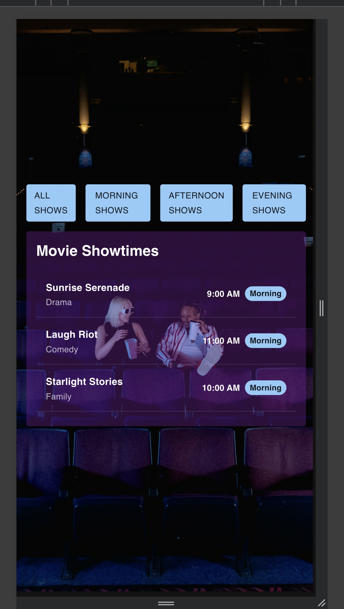
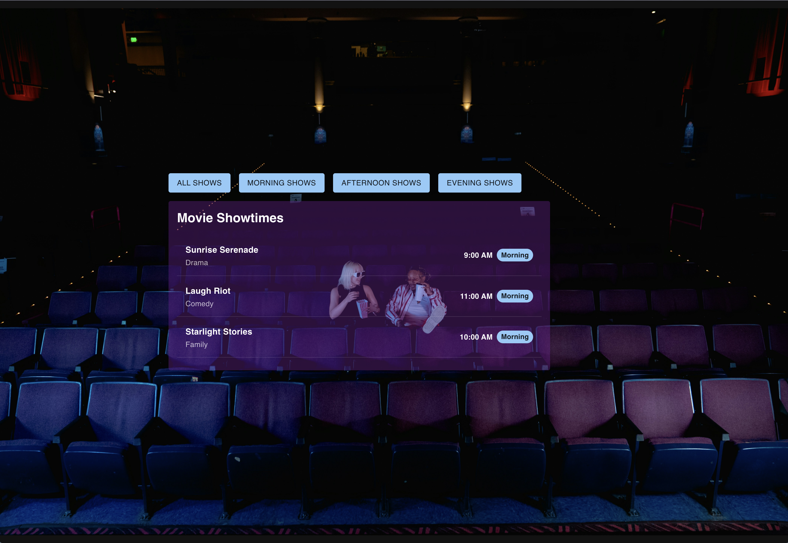

# Movie Showtime

React Typescript App using MUI components to view Movie showtimes and sort by timeslots

## Installation

```bash
npm install
```

## Run on localhost

```bash
npm run dev
```

## Things that can be improved on

- Navbar can be done with all MUI components
- Navlinks should stack on mobile
- Navlink buttons could be their own components and have active states
- Units used for styling could be uniform (Sticking to pixels for example)
- Container sizing can be improved upon with some research

## Screenshots



